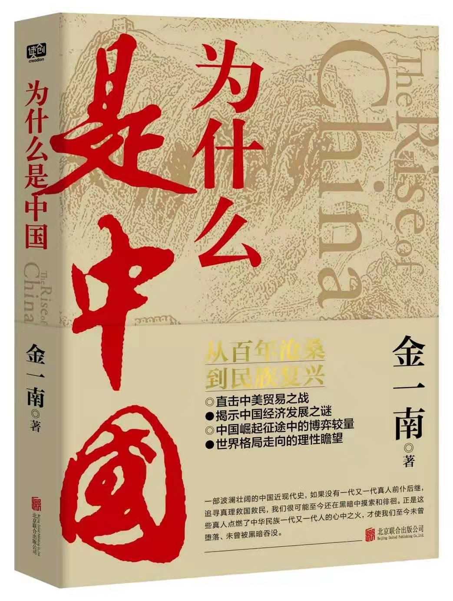
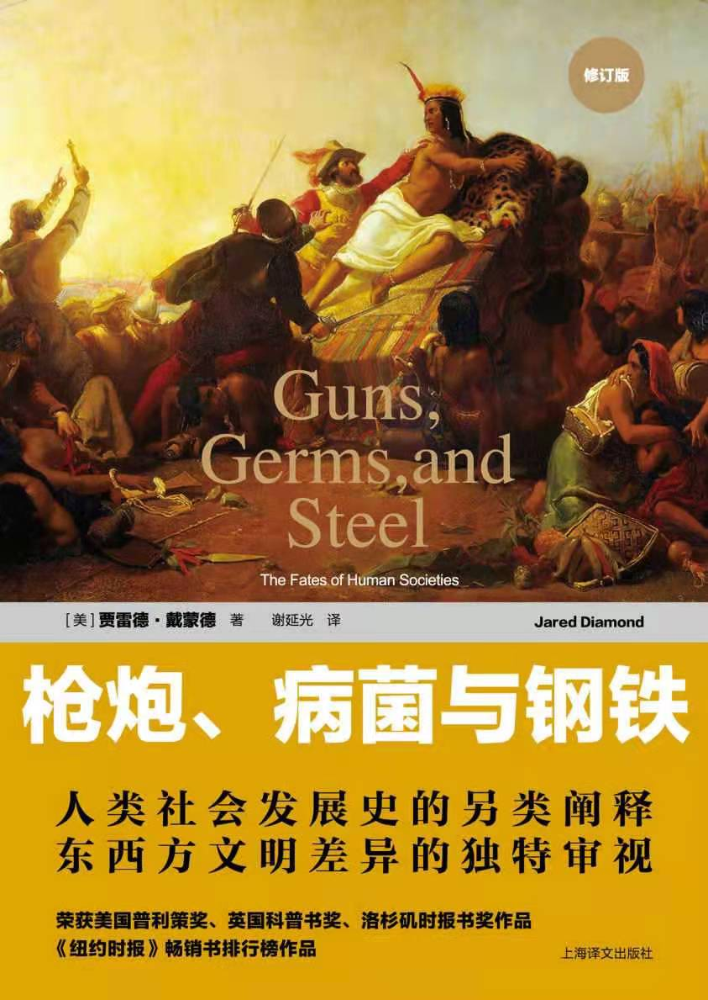
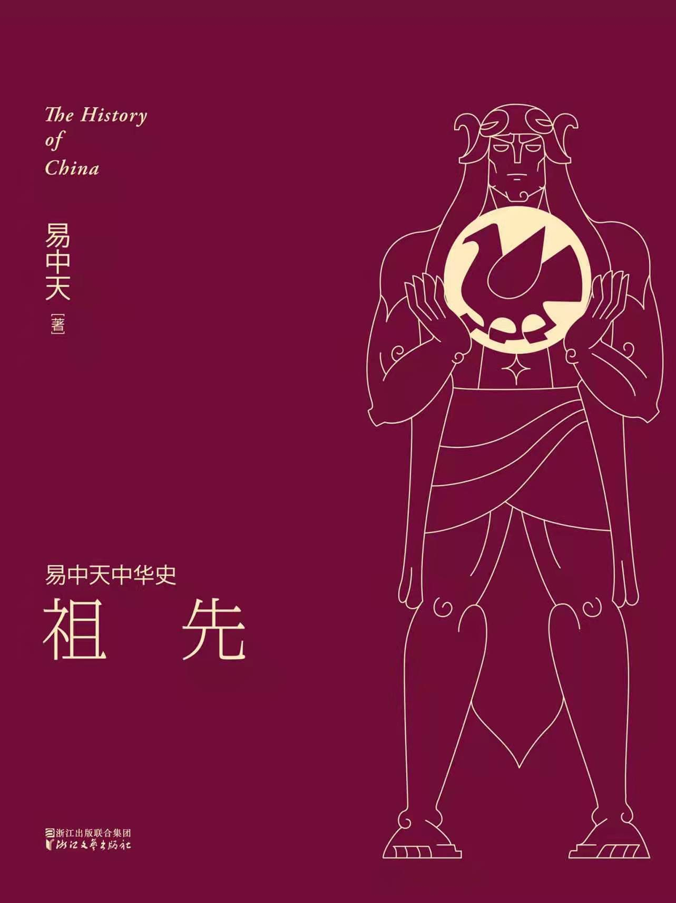
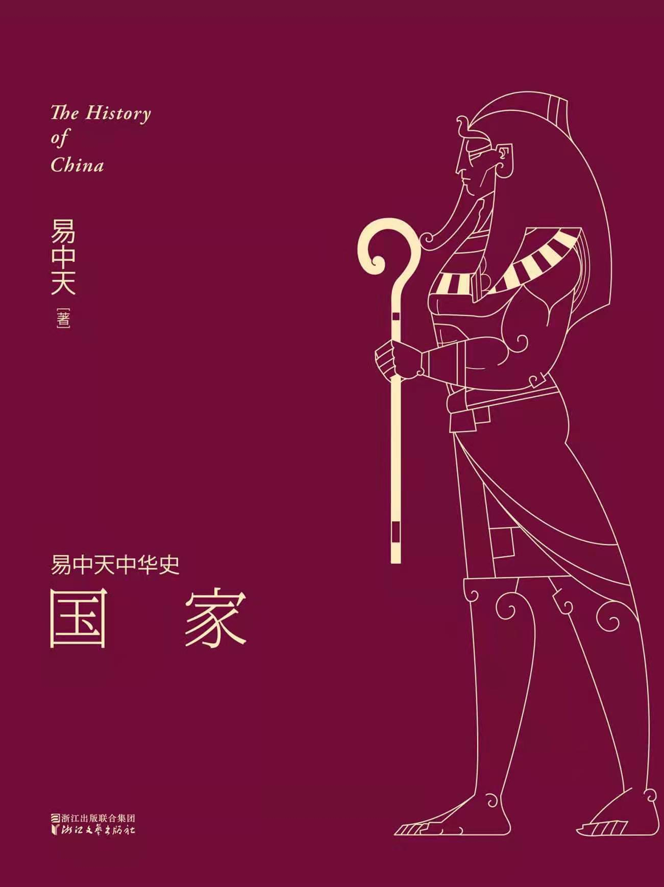
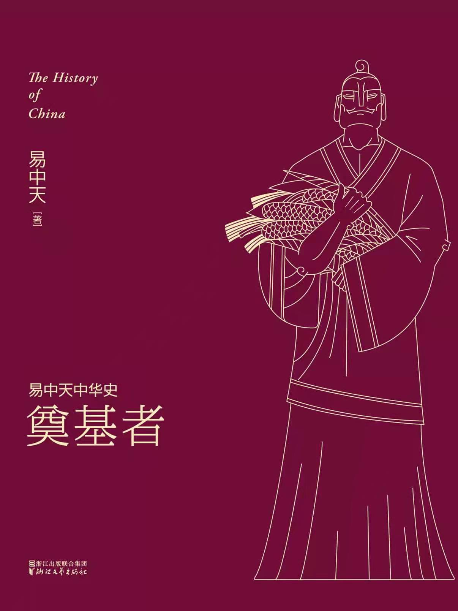
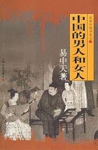
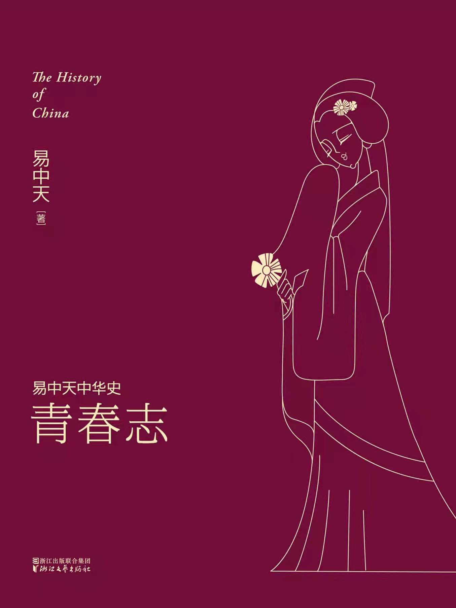
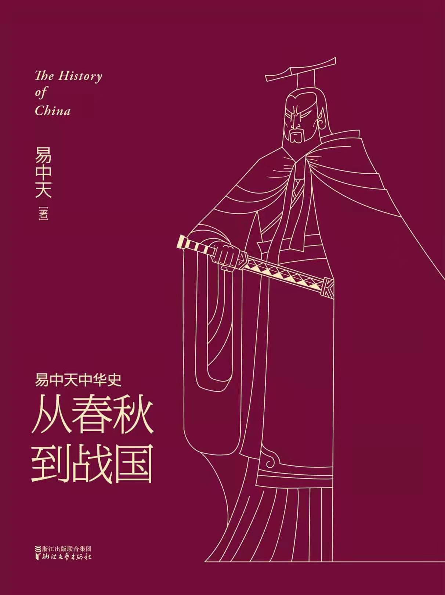
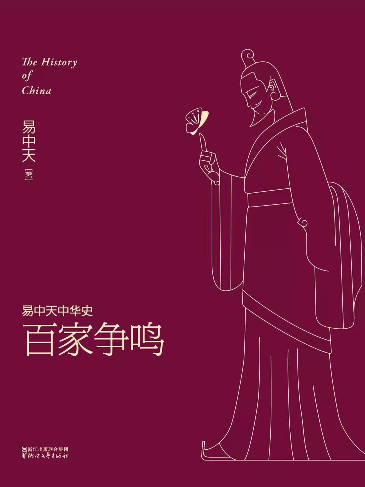
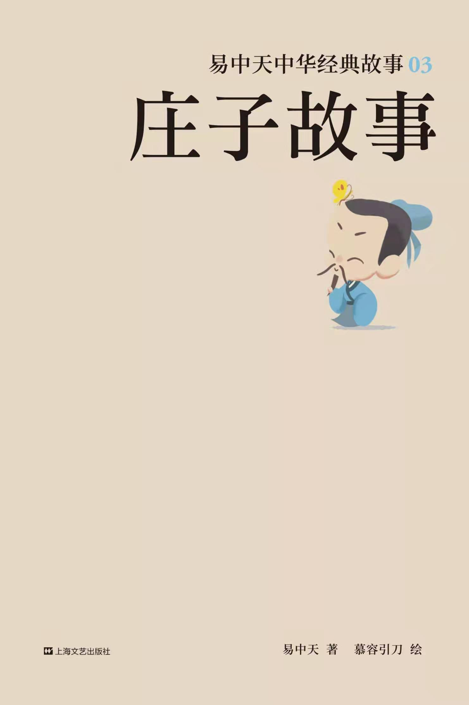

# 全部看完的非技术图书
+ [我的简历](../README.md)
## 2022年
+ 河森堡《进击的智人》一部由匮乏塑造的历史  

+ 金一南《为什么是中国》  

+ 美·雷德·戴蒙德《枪炮、病菌与钢铁》人类社会发展史的另类阐释 东西方文明差异的独特审视

+ 易中天《祖先》  

+ 易中天《国家》  

+ 易中天《奠基者》  

+ 易中天《中国的男人和女人》品读中国系列  

+ 易中天《青春志》  

+ 易中天《从春秋到战国》  

+ 易中天《百家争鸣》  

+ 易中天《庄子故事》中华经典故事  

+ 戴尔·卡耐基《人性的弱点》如何赢得友谊并影响他人  
